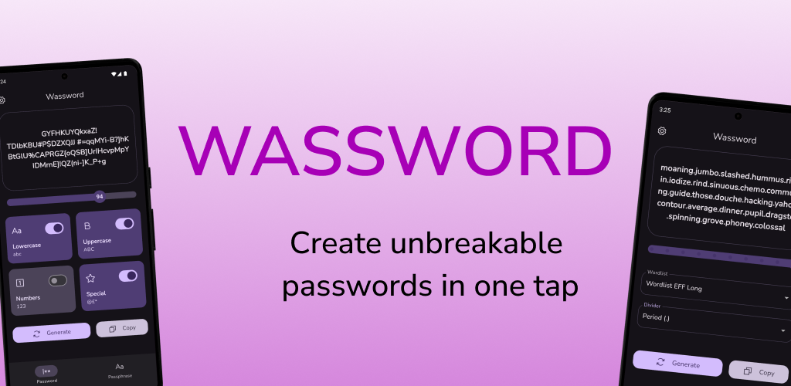
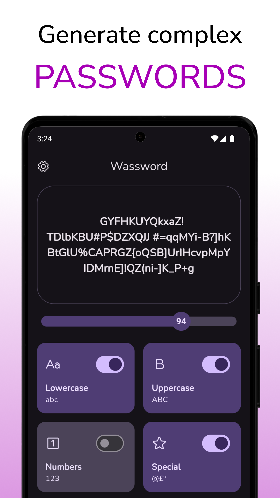
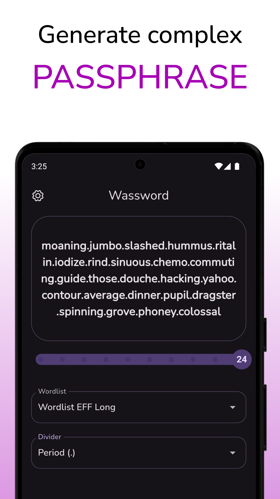
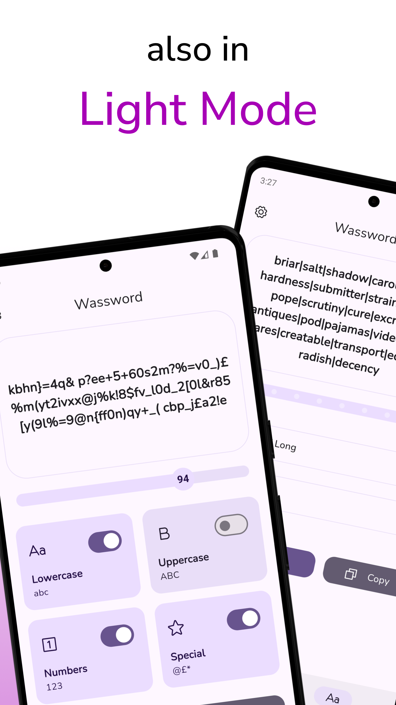

    
    
    
  

With Wassword you can easily generate complex passwords and use them for your online accounts. Choose length and chars to be used and generate your passwords safely.

Everything works offline and nothing is shared, your safety comes first.

**Wassword isn't a password manager, it doesn't store generated password. Wassword only creates password!**

### Features

- Create password with **Numbers**, **Lower case letters**, **Upper case letters**, **Symbols**, **8 to 128 chars**
- Generate passhrase with [EFF's New Wordlists for Random Passphrases](https://www.eff.org/deeplinks/2016/07/new-wordlists-random-passphrases) and choose between: [eff-long](https://github.com/redacted/XKCD-password-generator/blob/master/xkcdpass/static/eff-long), [eff-short](https://github.com/redacted/XKCD-password-generator/blob/master/xkcdpass/static/eff-short) and [eff-special](https://github.com/redacted/XKCD-password-generator/blob/master/xkcdpass/static/eff-special)
- **Copy** generated passwords and passphrase
- **Generate** as many passwords and passphrases as you want
- **[Riverpod](https://riverpod.dev/)** as a state management library
- Support for **dark** and **light** mode
- Support for large screen with [Navigation rail](https://m3.material.io/components/navigation-rail/overview)

### 📱 Screenshots

| Password Generation | Passphrase Generation | Light Mode |
|-|-|-|
|  |  |  |

## 🏆 Credits 

* <a href="https://www.flaticon.com/packs/countrys-flags" title="Icon Pack: Country Flags | Rounded">Icon Pack: Country Flags | Rounded</a>
* <a href="https://www.flaticon.com/authors/freepik" title="flaticon.com Freepik">Freepik on Flaticon</a>

## ❤️‍🔥 Contributions

Feel free to contribute to this project.

If you find a bug or want a feature, but don't know how to fix/implement it, please fill an [issue](https://github.com/polilluminato/wassword-flutter/issues). 
If you fixed a bug or implemented a feature, please send a [pull request](https://github.com/polilluminato/wassword-flutter/pulls).

Made with [contrib.rocks](https://contrib.rocks).

## 📋 License

Wassword is released under the [MIT license](LICENSE.md). You can use the code for any purpose, including commercial projects.

