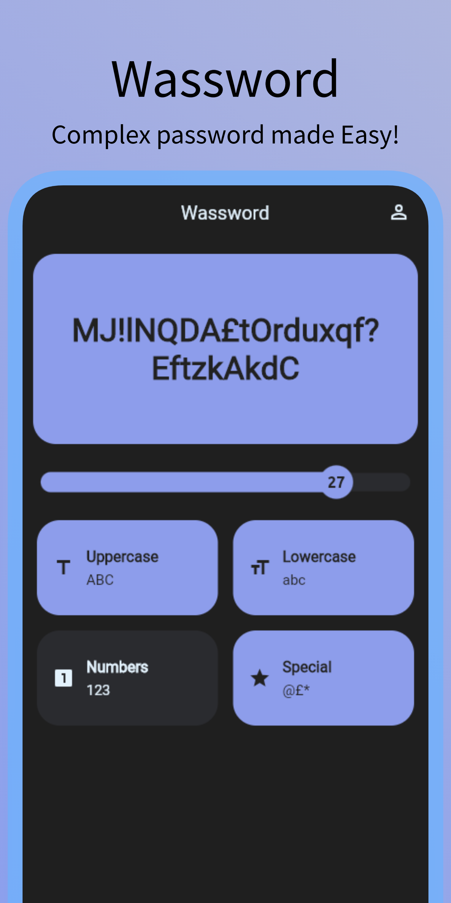
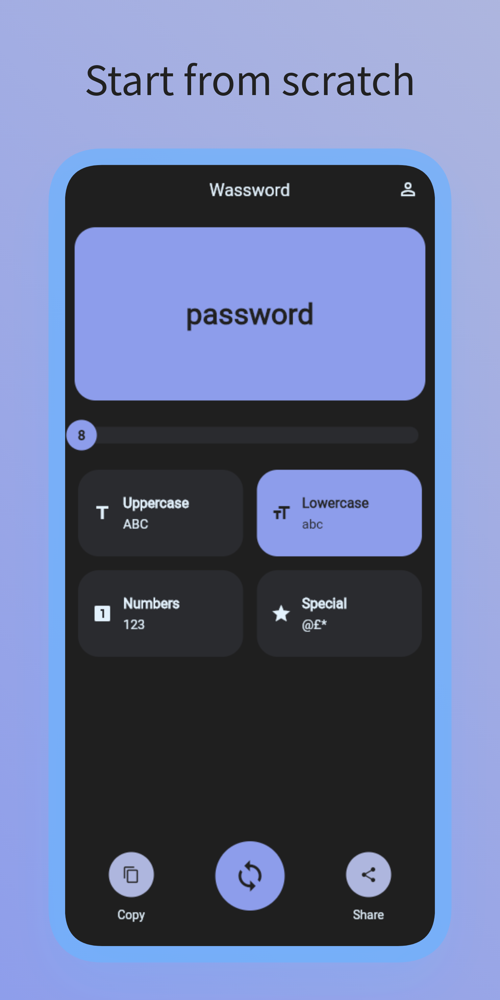

<div align="center">
  <h1>Wassword<br>Wonderful Password Generator</h1>
  <p align="center">
  <a href="https://dart.dev/"></a>
  <a href="https://flutter.dev/"></a>
  </p>
</div>

With Wassword you can easily generate complex passwords and use them for your online accounts. Choose length and chars to be used and generate your passwords safely.

Everything works offline and nothing is shared, your safety comes first.

**Wassword isn't a password manager, it doesn't store generated password. Wassword only creates password!**

<p align="center">
  <a href="https://play.google.com/store/apps/details?id=com.albertobonacina.wassword"></a>
  <a href="https://f-droid.org/it/packages/com.albertobonacina.wassword/"></a>
  <a href="https://wassword.albertobonacina.com/"></a>
</p>

### 🔒 Features

- Create password with
  - **Numbers**
  - **Lower case letters**
  - **Upper case letters**
  - **Symbols**
  - from **8 to 32 chars**
- **Copy** generated passwords
- **Share** generated passwords
- **Generate** as many passwords as you want
- **[Bloc](https://bloclibrary.dev/)** as a state management library

### 📱 Screenshots

| Screenshot #1 | Screenshot #2 | Screenshot #3 |
|-|-|-|
|  |  |  |

## 💎 Contributing

If you have any idea, feel free to fork it and submit your changes back to me.


## 📋 License

```
Copyright 2022 Alberto Bonacina

Licensed under the Apache License, Version 2.0 (the "License");
you may not use this file except in compliance with the License.
You may obtain a copy of the License at

   http://www.apache.org/licenses/LICENSE-2.0

Unless required by applicable law or agreed to in writing, software
distributed under the License is distributed on an "AS IS" BASIS,
WITHOUT WARRANTIES OR CONDITIONS OF ANY KIND, either express or implied.
See the License for the specific language governing permissions and
limitations under the License.
```
